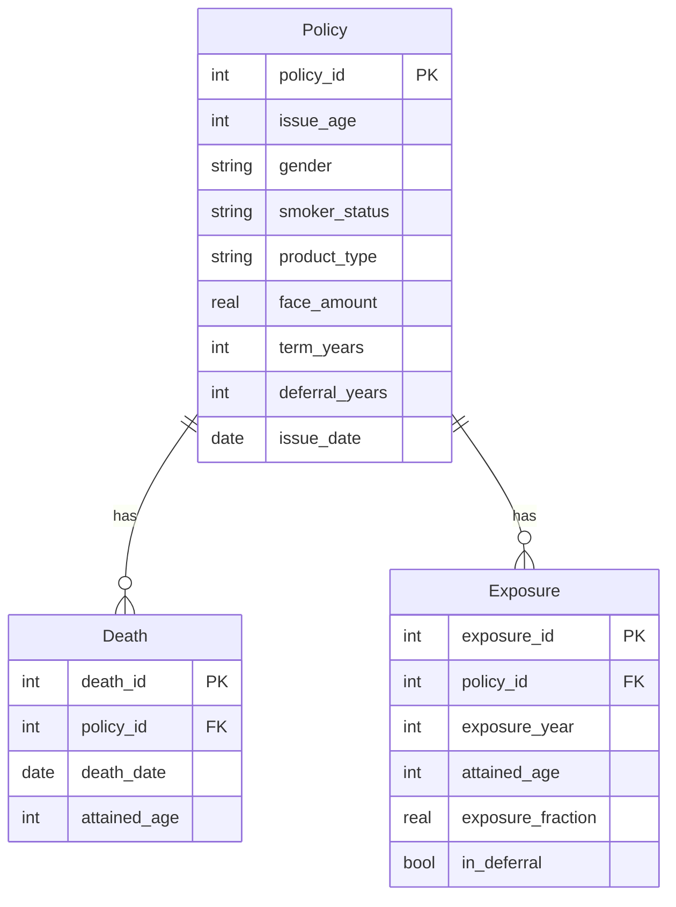

# Phase 2 — Database Design

## Overview

This phase designs the SQLite database that stores all policy, mortality, and exposure data for the pricing model. The schema is built to support three products — **Term Life**, **Whole Life**, and **Deferred Life** — within a single, unified set of tables, rather than separate schemas per product.

## Tables

### Policy

Stores one row per policy, capturing its characteristics at issue.

| Column | Type | Notes |
|---|---|---|
| policy_id | INTEGER PRIMARY KEY | Unique identifier |
| issue_age | INTEGER | Age at issue |
| gender | TEXT | 'M' / 'F' |
| smoker_status | TEXT | 'Smoker' / 'Nonsmoker' |
| product_type | TEXT | 'Term', 'Whole Life', or 'Deferred' |
| face_amount | REAL | Death benefit sum assured |
| term_years | INTEGER, nullable | Populated only for Term policies |
| deferral_years | INTEGER, nullable | Populated only for Deferred policies |
| issue_date | DATE | Policy issue date |

**Design decision:** rather than building separate tables per product, `product_type` acts as a discriminator, with `term_years` and `deferral_years` left NULL for products where they don't apply. This keeps the schema unified and queryable across products, closer to how an insurer's actual data warehouse is structured, while still capturing product-specific attributes.

### Death

Stores one row per death event.

| Column | Type | Notes |
|---|---|---|
| death_id | INTEGER PRIMARY KEY | Unique identifier |
| policy_id | INTEGER, FK → Policy | Policy the death occurred on |
| death_date | DATE | Date of death |
| attained_age | INTEGER | Age at death |

This table is identical in structure across all three products — a death event is recorded the same way regardless of product type. Product-specific logic (e.g., whether a claim is payable at that point) is applied when this data is used downstream, not in the table structure itself.

### Exposure

Stores one row per policy per exposure year — the time a policy was actually at risk, used as the denominator in mortality rate calculations (Deaths ÷ Exposure).

| Column | Type | Notes |
|---|---|---|
| exposure_id | INTEGER PRIMARY KEY | Unique identifier |
| policy_id | INTEGER, FK → Policy | Policy this exposure period belongs to |
| exposure_year | INTEGER | Policy year (1, 2, 3, ...) |
| attained_age | INTEGER | Age during this exposure year |
| exposure_fraction | REAL | Fraction of the year exposed (1.0 = full year; less if issued, lapsed, or died mid-year) |
| in_deferral | BOOLEAN | TRUE if this exposure year falls within a Deferred policy's waiting period |

**Design decision — the `in_deferral` flag:** exposure is the product dimension that genuinely differs by product type. Term exposure ends when the term expires; Whole Life exposure continues indefinitely; Deferred policies are not at risk of a claim during their waiting period. Rather than excluding deferral-period rows entirely, they're retained and flagged with `in_deferral = TRUE`, so the full policy history stays in one table, and the mortality experience study (Phase 4) can simply filter out deferral-period rows when calculating claim exposure.

## Design Note: PRAGMA foreign_keys

SQLite does not enforce foreign key constraints by default, even though they're declared in the schema (`Death.policy_id` and `Exposure.policy_id` both reference `Policy.policy_id`). Enforcement must be explicitly turned on per session/connection with:

```sql
PRAGMA foreign_keys = ON;
```

This is documented at the top of `sql/create_tables.sql`, and must be run again in any future connection to this database (e.g., from R via `RSQLite`) — it is not a setting saved permanently in the database file.

## Entity Relationship Diagram



## Files

- `sql/create_tables.sql` — schema creation script (includes the PRAGMA note above)
- `sql/pricing_model.db` — the actual SQLite database file (excluded from Git via `.gitignore`; regenerate locally by running `create_tables.sql`)