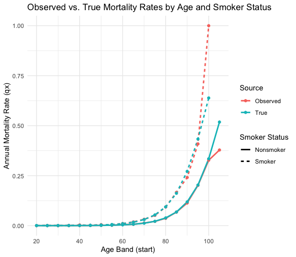

# Phase 4 — Mortality Experience Study

## Overview

This phase analyzes the synthetic Death and Exposure data generated in Phase 3, calculating observed mortality rates (Deaths ÷ Exposure) by age and smoker status, and validates those observed rates against the "true" Gompertz-Makeham mortality pattern the data was simulated from. This mirrors the real actuarial process of deriving mortality assumptions from claims experience — the key difference being that, in this synthetic exercise, the "true" answer is known in advance, allowing the study's accuracy to be directly measured.

## Age Banding

Mortality rates are calculated using **5-year age bands** (20–24, 25–29, ..., 100+) rather than single-year ages. Single-year mortality rates would be unreliable at older ages, where exposure is thin — a single additional death at, say, age 98 could swing that age's rate dramatically, since very few policies survive to that age. Grouping into 5-year bands smooths this noise by pooling more exposure per group, at the cost of some age granularity — a standard tradeoff in real actuarial experience studies, which commonly use banded ages for the same reason.

## Methodology

### Exposure Aggregation

Exposure was pulled from SQL and grouped into age bands using integer-division banding (`(attained_age / 5) * 5`), joined to the Policy table to bring in smoker status, and summed within each age-band/smoker group:

```sql
SELECT 
    (Exposure.attained_age / 5) * 5 AS age_band_start,
    Policy.smoker_status,
    SUM(Exposure.exposure_fraction) AS total_exposure
FROM Exposure
JOIN Policy ON Exposure.policy_id = Policy.policy_id
WHERE Exposure.in_deferral = 0
GROUP BY age_band_start, Policy.smoker_status
```

**Design decision — excluding deferral-period exposure:** the `WHERE in_deferral = 0` filter excludes exposure-years that fall within a Deferred Whole Life policy's waiting period. This follows directly from the Phase 2 schema design: no claim is possible during deferral, so those years should not count as "at risk of claim" exposure in a mortality study measuring claim likelihood.

### Death Aggregation

Deaths were aggregated the same way, joined to Policy for smoker status, counted per age band:

```sql
SELECT 
    (Death.attained_age / 5) * 5 AS age_band_start,
    Policy.smoker_status,
    COUNT(*) AS total_deaths
FROM Death
JOIN Policy ON Death.policy_id = Policy.policy_id
GROUP BY age_band_start, Policy.smoker_status
```

No deferral filter was needed here, since death risk was never simulated during deferral periods in the first place (Phase 3) — every recorded death is already claim-eligible by construction.

### Handling Zero-Death Groups

A left join (`merge(..., all.x = TRUE)`) was used to combine exposure and death data, explicitly preserving age-band/smoker combinations with **zero recorded deaths** (which a standard inner join or a `GROUP BY` alone would silently drop). Missing death counts from the join were set to 0 rather than left as missing, since "no matching death record" genuinely means zero deaths occurred in that group, not that the value is unknown.

### Observed Mortality Rate


calculated per age band per smoker status.

## Validation Against the True Mortality Pattern

Observed rates were compared against the true Gompertz-Makeham qx, evaluated at each band's midpoint (band start + 2), since the observed rate reflects an average across all ages within the 5-year band.

**Result: strong recovery of the true pattern across the well-populated age range (roughly 40–95).** Observed and true rates track closely — for example, age 65 Nonsmoker: 0.696% observed vs. 0.700% true; age 80 Smoker: 9.33% observed vs. 9.40% true. The smoker-to-nonsmoker ratio at matched ages consistently runs close to the built-in 2.5x multiplier (e.g., age 80: 9.33% / 3.68% ≈ 2.5x), confirming both the simulation and the study correctly reproduce the intended mortality structure.

**Divergence at the extremes is expected and is itself a legitimate finding.** At very young ages (20–30), true mortality is already so low (a few in ten-thousand) that several age-band/smoker cells recorded zero deaths despite genuine underlying risk — an artifact of limited exposure at low probabilities, not an error. At the oldest ages (100+), very few policies survive that long, so observed rates become highly volatile (e.g., Smoker age 100: only 2 exposure-years produced an observed rate of 100%, against a true rate of 63.9%). This reflects a general and well-known property of experience studies: reliability depends on exposure volume, and both tails of the age distribution are inherently data-sparse.

## Visualization



The chart plots observed and true mortality rates by age band and smoker status, on a linear y-axis. Because mortality rates span roughly three orders of magnitude across the full age range (from ~0.0003 at age 20 to ~1.0 at age 100+), the linear scale compresses the under-70 portion of the curve close to zero visually, while making the steep rise at older ages clearly visible. All four series (Observed/Nonsmoker, Observed/Smoker, True/Nonsmoker, True/Smoker) are shown with distinct colors.

## Limitations & Simplifying Assumptions

- **Thin exposure at the oldest ages (95+) produces volatile, less reliable observed rates** — a general property of experience studies, not specific to this dataset.
- **5-year age bands trade granularity for stability** — a deliberate, documented choice; single-year rates would be noisier, especially at older ages.
- **The linear-scale chart compresses detail at younger ages** — mortality differences below roughly age 60 are hard to distinguish visually, though fully visible in the underlying data table.
- **`calculate_qx()` is duplicated** across R scripts (Phase 3 and Phase 4) rather than centralized in a shared file — a deliberate simplicity tradeoff for this project's scope, at the cost of needing to keep both copies in sync if the function ever changes.

## Files

- `r/04_mortality_study.R` — SQL aggregation queries, observed mortality calculation, true-rate comparison, and visualization
- `outputs/04_mortality_observed_vs_true.png` — the observed vs. true mortality chart