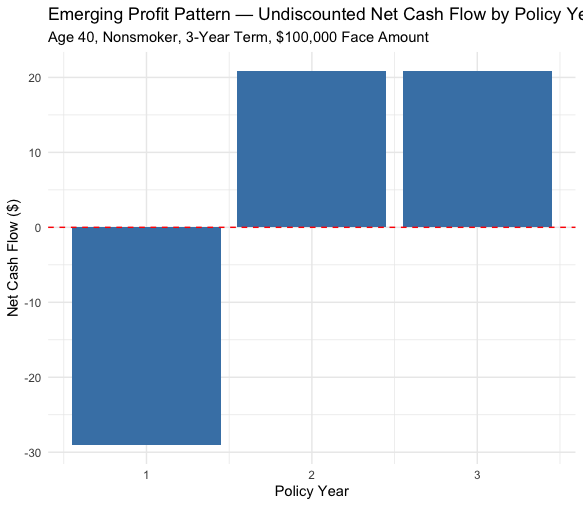

# Phase 7 — Profit Testing

## Overview

This phase projects year-by-year expected cash flows for a priced policy and validates that the bottom-up (cash flow projection) and top-down (Phase 6's premium solve) views of profitability are mathematically consistent. It also visualizes the emerging profit pattern — the shape of profit and loss across a policy's lifetime — a standard and important actuarial concept.

## Cash Flow Projection — `calculate_cashflows()`

For each policy year, three cash flow components are projected, each survival-weighted but **not yet discounted**:

$$\text{Premium}_t = {}_{t}p_x \times \text{Gross Premium}$$
$$\text{Claim}_t = {}_{t}p_x \times q_{x+t-1} \times \text{Face}$$
$$\text{Maintenance}_t = {}_{t}p_x \times E_{\text{maint}}$$

Issue expense is applied only in year 1 (a one-time cost). Net cash flow for year t:

$$\text{Net CF}_t = \text{Premium}_t - \text{Claim}_t - \text{Maintenance}_t - \text{Issue}_t$$

**Example (age 40, Nonsmoker, 3-year Term, premium $75.21):**

| Year | Premium In | Claim Out | Maint Out | Issue Out | Net Cash Flow |
|---|---|---|---|---|---|
| 1 | $75.22 | $44.29 | $10.00 | $50.00 | **−$29.07** |
| 2 | $75.18 | $44.27 | $10.00 | $0 | **$20.92** |
| 3 | $75.15 | $44.25 | $9.99 | $0 | **$20.91** |

This demonstrates **surplus strain** — a well-known actuarial pattern where early policy years show a loss (driven by front-loaded issue expense against only one year's premium income), while later years show healthy positive profit once that one-time cost is behind the policy. Insurers must hold capital to fund this early-year strain across a large block of new business.

## PV of Future Profits — `calculate_pv_profit()`

### A Timing Bug Found and Corrected

An initial implementation combined all cash flow components into a single `net_cashflow` per year and applied one uniform discount factor. This produced an incorrect result ($9.34) that did not reconcile with the target profit implied by Phase 6's premium solve ($17.20 for the worked example).

**Root cause:** premiums, claims/expenses, and issue expense follow different timing conventions (established in Phase 6): premiums are paid at the **start** of the year (discount factor uses $t-1$), claims and maintenance expenses occur at **year-end** (discount factor uses $t$), and issue expense occurs at **time 0** (no discounting at all). Bundling these into one net figure before discounting applied the wrong discount factor to premiums and issue expense.

**Fix:** each component is discounted separately, using its correct convention, before being netted:

$$PV(\text{Premiums}) = \sum_{t=1}^{n} \text{Premium}_t \times \frac{1}{(1+i)^{t-1}}$$

$$PV(\text{Claims}) = \sum_{t=1}^{n} \text{Claim}_t \times \frac{1}{(1+i)^{t}}, \quad PV(\text{Maintenance}) = \sum_{t=1}^{n} \text{Maintenance}_t \times \frac{1}{(1+i)^{t}}$$

$$PV(\text{Issue}) = \text{Issue Expense (undiscounted)}$$

$$PV(\text{Profit}) = PV(\text{Premiums}) - PV(\text{Claims}) - PV(\text{Maintenance}) - PV(\text{Issue})$$

**After the fix**, PV(Profit) for the worked example reconciled exactly to $17.198, matching Phase 6's target (8% of PV(Premiums) = $214.98) to within floating-point rounding. This validates that the pricing engine (top-down premium solve) and profit testing (bottom-up cash flow projection) are internally consistent — a meaningful cross-check between two independently built pieces of the project.

## Achieved Profit Margin — `calculate_profit_margin()`

$$\text{Margin} = \frac{PV(\text{Profit})}{PV(\text{Premiums})}$$

For the worked Term example, this returned 0.079999 — matching the 8% target margin to within floating-point precision.

## Visualization

A bar chart of undiscounted net cash flow by policy year for the worked example, with a reference line at zero. Year 1 shows a clear loss (issue-expense-driven); Years 2–3 show consistent positive profit — visually demonstrating the surplus strain pattern.

## Validation Across All Three Products

The pricing and profit testing pipeline was run across six test policies (the same set used in Phase 6's validation):

| Product | Age | Smoker | Deferral | Gross Premium | PV(Profit) | Achieved Margin |
|---|---|---|---|---|---|---|
| Term | 30 | Nonsmoker | — | $86.83 | $90.38 | 0.08 |
| Term | 30 | Smoker | — | $181.20 | $187.93 | 0.08 |
| Whole Life | 50 | Nonsmoker | — | $1,387.99 | $3,514.24 | 0.15 |
| Whole Life | 50 | Smoker | — | $2,194.18 | $4,980.96 | 0.15 |
| Deferred Whole Life | 40 | Nonsmoker | 5 yr | $778.73 | $1,721.23 | 0.12 |
| Deferred Whole Life | 40 | Nonsmoker | 10 yr | $761.68 | $1,688.22 | 0.12 |

**Every achieved margin matches its product's Phase 5 target exactly**, confirming the corrected profit testing logic generalizes correctly across all three products, not just the single hand-verified example.

**Note on PV(Profit) scale:** absolute PV(Profit) is substantially larger for Whole Life and Deferred Whole Life than Term, reflecting their much longer projected duration (to age 105) rather than any difference in per-year profitability — achieved margin, not absolute PV(Profit), is the appropriate metric for comparing profitability across products of different durations.

## Limitations & Simplifying Assumptions

- **Cash flow projection uses expected (probability-weighted average) values**, not a stochastic simulation of individual policy outcomes — consistent with the deterministic approach used throughout Phases 6–7.
- **The surplus strain example shown is based on a short 3-year Term policy**; the pattern would look different (though the same underlying loss-then-profit shape) for longer-duration products.

## Files

- `r/07_profit_testing.R` — cash flow projection, PV(Profit) calculation (with the timing fix), profit margin calculation, visualization, and multi-product validation
- `outputs/07_emerging_profit_pattern.png` — the emerging profit pattern chart