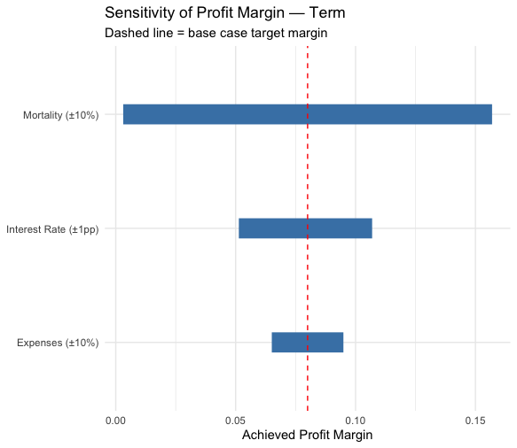
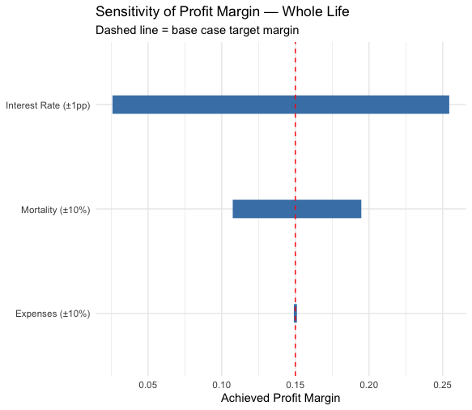
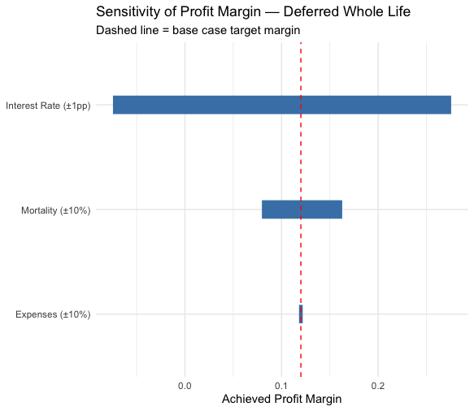

# Phase 8 — Sensitivity Analysis

## Overview

This phase tests how much a policy's profitability erodes or improves when actual experience differs from the assumptions used to price it. Three representative policies (one per product) are priced once using base-case assumptions, then their fixed, already-solved premium is tested against stressed mortality, interest rate, and expense scenarios — measuring the resulting achieved profit margin under each.

**Representative policies used:**
- **Term:** age 35, Nonsmoker, 20-year term, $100,000
- **Whole Life:** age 55, Nonsmoker, $100,000
- **Deferred Whole Life:** age 45, Nonsmoker, 5-year deferral, $100,000

**Stress scenarios tested:** Mortality ±10%, Interest Rate ±1 percentage point, Expenses ±10% (issue and maintenance).

## Design Principle: Price Once, Test Many Times

An early implementation combined premium-solving and profitability-testing into a single function that re-solved the premium under each stressed scenario. This was incorrect for sensitivity analysis purposes: re-solving the premium under a stressed assumption answers "what would we charge if we had correctly anticipated the stress?" — not the intended question, "what happens to profitability if we price on base-case assumptions but reality turns out different?"

**Corrected structure:** `calculate_gross_premium()` is called once per policy, using base-case assumptions only, producing a fixed premium. `test_profitability()` then evaluates that same fixed premium's achieved margin under each stressed scenario, without ever re-solving the price. This mirrors real actuarial sensitivity testing, where a priced product's in-force profitability is stress-tested against assumption risk, not repriced.

## Bug Found: Mortality Table Not Reaching Calculations

Initial mortality stress tests showed **zero change** in premium or margin under ±10% stressed mortality tables, despite the stress tables themselves being verified correct. Root cause: while `get_pricing_qx()` accepted a `mortality_data` parameter, none of the higher-level functions (`calculate_survival_probs`, `calculate_pv_claims`, `calculate_pv_expenses`, `calculate_annuity_factor`, `calculate_gross_premium`, `calculate_cashflows`) passed a `mortality_data` argument through to their internal calls — every calculation silently fell back to the real, unstressed table regardless of intent.

**Fix:** every function in the chain was updated to accept `mortality_data` (defaulting to the real table) and pass it through to each nested function call. This was verified function by function: at each step, a stressed-table call was confirmed to produce a different (and directionally correct) result from the base-table call before moving to the next function in the chain.

**Note on scope:** this fix was applied only within `08_sensitivity_analysis.R`. The duplicated copies of these functions in `06_pricing_engine.R` and `07_profit_testing.R` were left unchanged, since they are never called with a non-default `mortality_data` in those scripts and therefore produce correct results as-is. This means the three scripts' copies of these functions are no longer identical — a deliberate scope decision, documented here rather than propagating the fix to scripts that did not require it.

## Results by Assumption

### Mortality (±10%)

| Product | Base Margin | +10% Mortality | −10% Mortality |
|---|---|---|---|
| Term | 8.00% | 0.31% | 15.69% |
| Whole Life | 15.00% | 10.75% | 19.48% |
| Deferred Whole Life | 12.00% | 7.97% | 16.28% |

**Term's margin is nearly eliminated by a 10% adverse mortality deviation** (8.00% → 0.31%), a far larger proportional impact than Whole Life or Deferred Whole Life experience under the same stress. This reflects Term's thinner base-case margin (8% vs. 15%/12%) providing much less buffer to absorb an adverse deviation of the same proportional size.

### Interest Rate (±1 percentage point)

| Product | Base Margin | +1pp (6%) | −1pp (4%) |
|---|---|---|---|
| Term | 8.00% | 10.69% | 5.13% |
| Whole Life | 15.00% | 25.45% | 2.58% |
| Whole Life | Deferred | 27.55% | **−7.45%** |

*(Deferred Whole Life row above: base 12.00%, +1pp 27.55%, −1pp −7.45%)*

**Deferred Whole Life becomes unprofitable (negative margin) under a 1-percentage-point adverse interest rate shift.** Interest rate sensitivity increases substantially with policy duration — Whole Life and Deferred Whole Life project cash flows out to age 105, so a small rate change compounds over decades ($(1+i)^t$ with large $t$), producing a much larger present-value swing than the same rate change applied to Term's much shorter horizon. This mirrors standard fixed-income duration risk.

### Expenses (±10%)

| Product | Base Margin | +10% Expenses | −10% Expenses |
|---|---|---|---|
| Term | 8.00% | 6.51% | 9.49% |
| Whole Life | 15.00% | 14.90% | 15.10% |
| Deferred Whole Life | 12.00% | 11.81% | 12.19% |

Expense risk is the smallest of the three tested dimensions for every product, particularly for Whole Life and Deferred Whole Life, where the swing is under half a percentage point. Expenses are small, fixed dollar amounts relative to claims (up to full face amount) and the compounding effect of discounting, limiting their proportional impact on margin.

## Tornado Charts

Each chart ranks the three tested assumptions by swing width (widest = most impactful), with a dashed line marking the base-case target margin.

**Key finding: each product has a different dominant risk.**
- **Term is most exposed to mortality risk** — its shorter duration limits interest rate exposure, but its thin 8% margin leaves little room to absorb adverse mortality.
- **Whole Life and Deferred Whole Life are most exposed to interest rate risk**, a direct consequence of their long projection horizon (to age 105) — mortality and expense risk, while present, are secondary by comparison.

This is a genuine and defensible actuarial insight: product duration and margin structure jointly determine which assumption a product's profitability is most vulnerable to, and this project's own pricing model reproduces that pattern from first principles rather than assuming it.

## Limitations & Simplifying Assumptions

- **Sensitivity was tested on one representative policy per product**, not the full 10,000-policy dataset — standard practice for illustrative sensitivity analysis, though results would vary by specific age/face amount/smoker status.
- **Stress scenarios are single, symmetric shocks (±10%, ±1pp)** applied independently; correlated or compound stresses (e.g., simultaneously worse mortality and lower interest rates) were not tested.
- **Function duplication across scripts is no longer consistent** — the `mortality_data` parameter fix was applied only in `08_sensitivity_analysis.R`, not retroactively in `06_pricing_engine.R` or `07_profit_testing.R`, a deliberate scope decision (see "Bug Found" above).

## Files

- `r/08_sensitivity_analysis.R` — corrected (price-once, test-many) sensitivity framework, mortality/interest/expense stress tests, tornado chart generation
- `outputs/08_tornado_term.png`, `outputs/08_tornado_whole_life.png`, `outputs/08_tornado_deferred_whole_life.png` — tornado charts by product